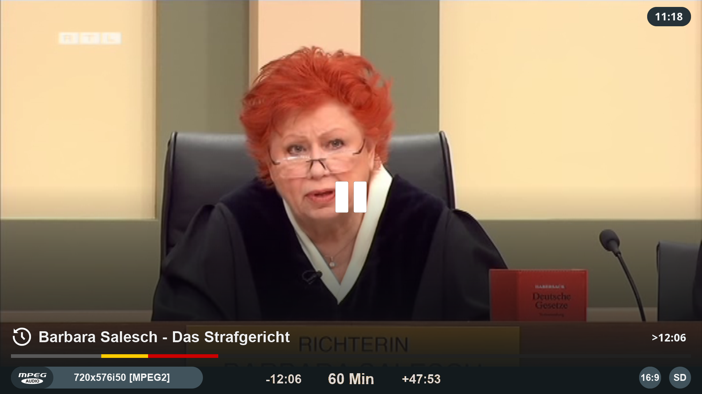
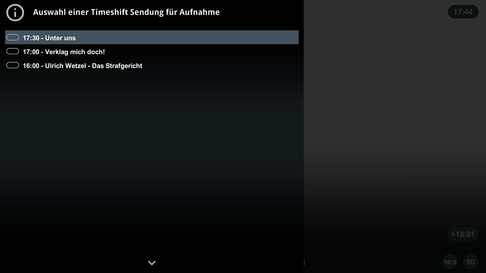
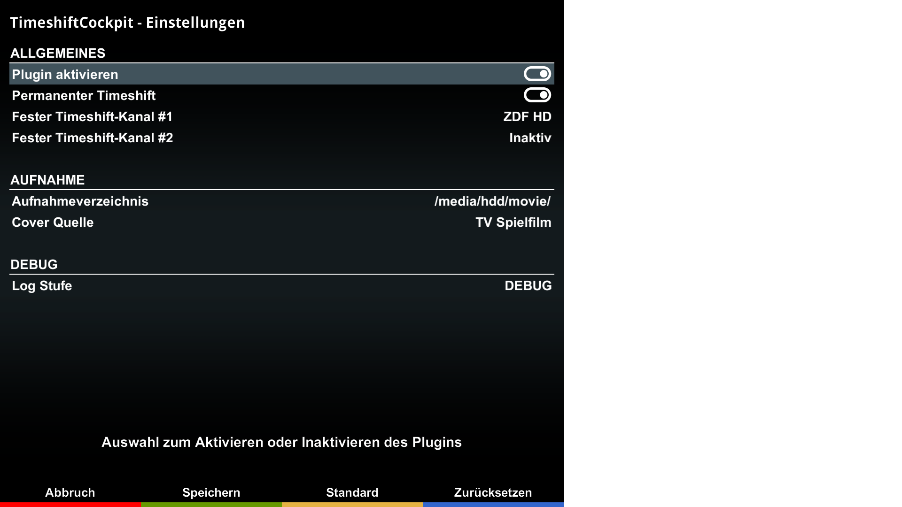
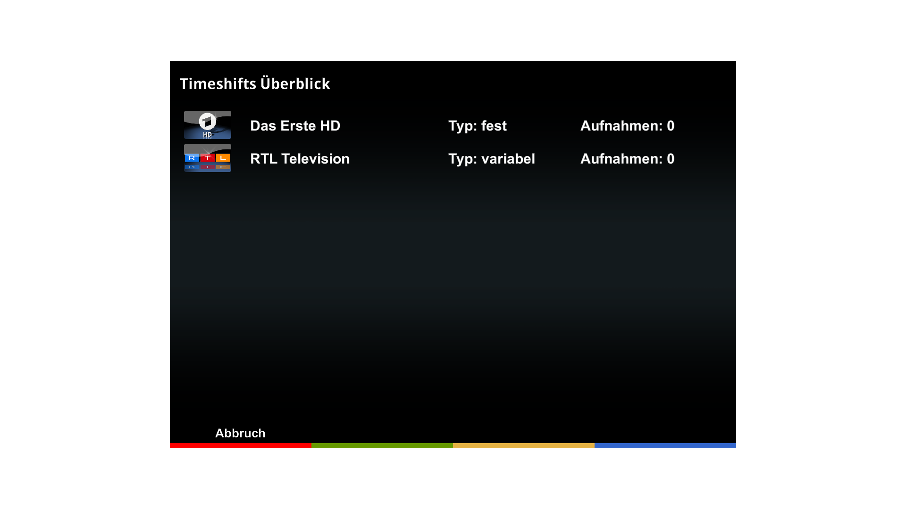
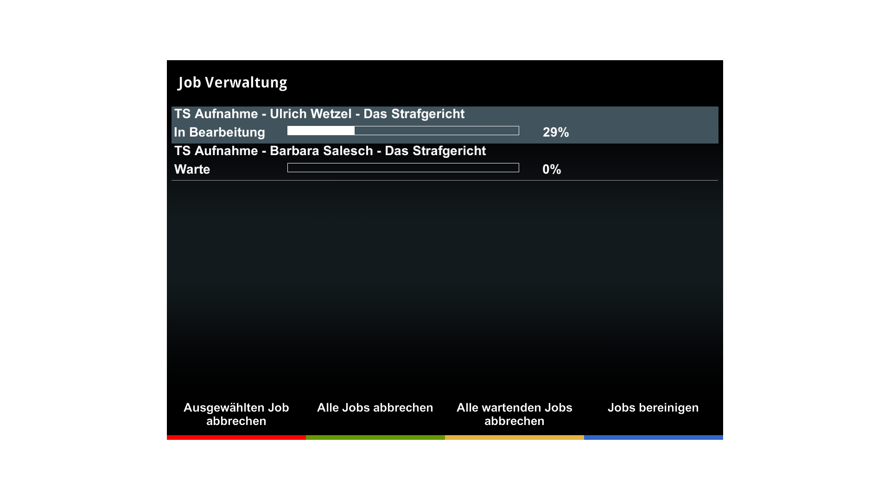

# TimeshiftCockpit (TSC)

MENU key shows a choice list of timeshift events for easy playback.

REC key shows a choice list of timeshift events for easy recording.

Configuration menu allows the preset of up to 2 permanent timeshift services.

Timeshifts Overview shows all active timeshift services.

Job Management menu allows to manage all timeshift recordings.

## Features
TimeshiftCockpit is a plugin for Enigma2 receivers that provides advanced timeshift functionality

- on demand timeshift (only timeshifts when manually started and stopped)
- permanent timeshift
	- variable permanent timeshift (always timeshifts current channel)
	- fixed permanent timeshift (of up to 2 fixed services)
- record every timeshift event (pressing the REC key)

## Usage

- PLAY/PAUSE to start on demand timeshift or playback of permanent timeshift
- On demand timeshift: STOP to exit timeshift playback and stop timeshift recording
- Permanent timeshift: STOP/EXIT to exit timeshift playback but continue with timeshift recording
- Cursor LEFT/RIGHT for fast forward/backward
- Cursor UP/DOWN to enter channel selection list
- CHANNEL/BOUQUET up/down for intelligent jump
- TAB left/right for previous/next event
- Permanent timeshift: MENU to display a choice list of events for playback
- REC to record any event contained in timeshift. If the event is the last one in timeshift and incomplete, timeshift will continue until the event is complete. If power off is pressed before recording is complete, recording will continue in idle mode.
- YELLOW shows a list of timeshift recording jobs
- BLUE shows a list of active timeshifts

## Limitations

- TSC is being tested on DM 920 and DM ONE (OE 2.6) only
- TSC may not work properly on AIO images due to driver changes
- TSC permanent timeshift is recommended for boxes with FBC tuners only (full permanent timeshift needs up to 4 tuners)

## Conflicts

- TSC conflicts with the permanent timeshift plugin (PTS), so remove PTS before installing TimeshiftCockpit

## Languages

- english
- german
- italian (by Spaeleus)
- spanish (by Magog)

## Links

- Installation: https://dream-alpha.github.io/TimeshiftCockpit
- Support: https://github.com/dream-alpha/TimeshiftCockpit/discussions
