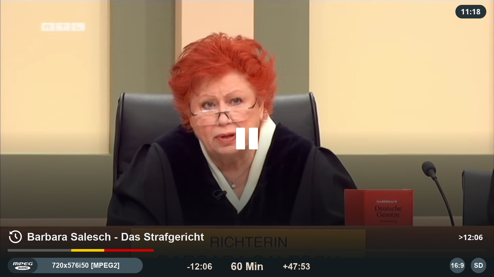

# TimeshiftCockpit (TSC)

## Features
TimeshiftCockpit is a plugin for DreamOS receivers that provides advanced timeshifting functionality like regular on demand timeshifting as well as permanent timeshifting.

## Limitations
- TSC is being tested on DM 920 and DM ONE only

## Installation
To install TimeshiftCockpit execute the following command in a console on your dreambox:
- apt-get install wget (required the first time only)
- wget https://dream-alpha.github.io/TimeshiftCockpit/timeshiftcockpit.sh -O - | /bin/sh

The installation script will also install a feed source that enables a convenient upgrade to the latest version with the following commands or automatically as part of a DreamOS upgrade:
- apt-get update
- apt-get upgrade

## Conflicts
- TSC conflicts with the permanent timeshift plugin (PTS), so both plugins can't coexist on the box

## Usage
- Play/pause to start timeshift
- On demand timeshift: Stop to exit timeshift playback and stop timeshift recording
- Permanent timeshift: Stop/Exit to exit timeshift playback but continue timeshift recording
- Cursor Left/right for fast forward/backward
- Cursor up/down to enter channel selection list
- Channel/Bouquet up/down for intelligent jump
- Tab left/right for previous/next event

## Languages
- english
- german
- italian (by Spaeleus)
- spanish (by Magog)

## Links
- Feed: https://gemfury.com/dream-alpha
- Support: https://github.com/dream-alpha/TimeshiftCockpit/discussions
